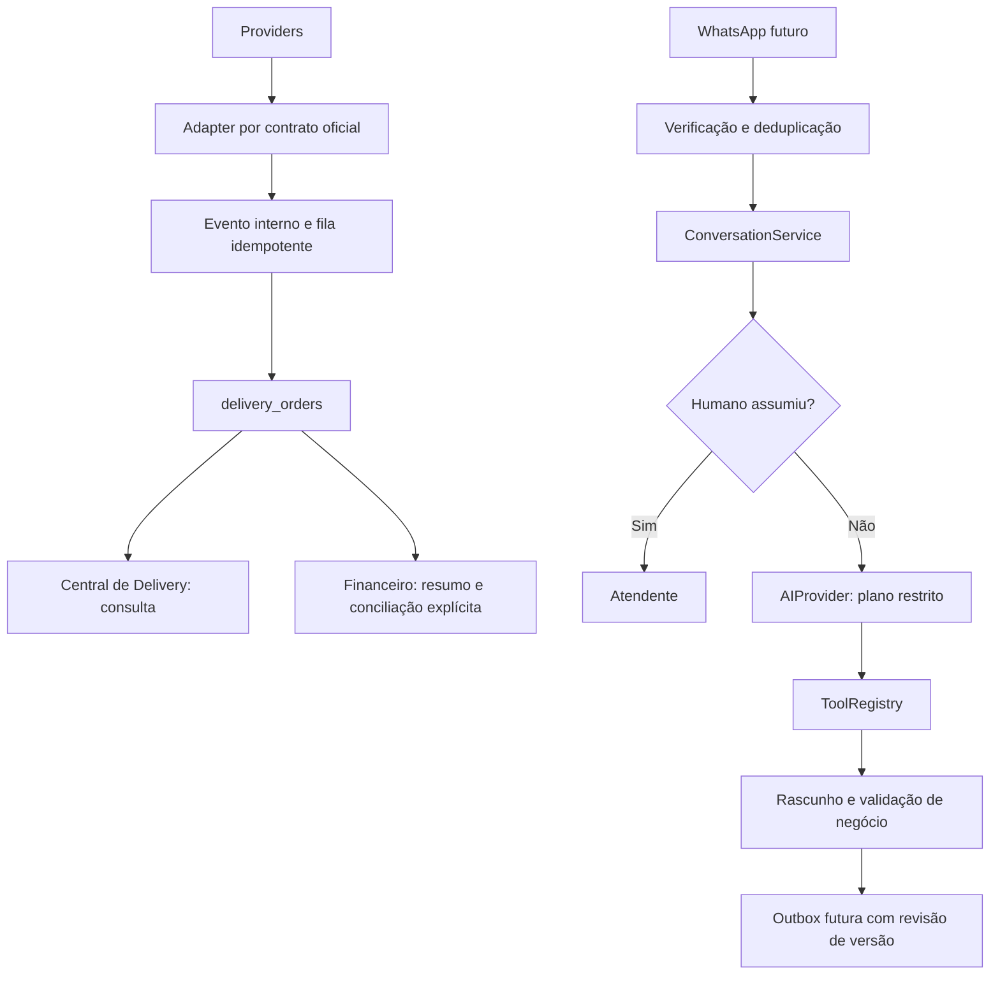

# Central de Delivery — base arquitetural

## Auditoria e decisões

Início: agente-2 limpa em 43b7227; origin/main em 8509a83. Nenhum merge realizado.
O sistema já possui quatro tabelas delivery protegidas, adaptador iFood distribuído,
fila/ACK, criptografia e consulta financeira. Não há entidades próprias de clientes,
conversas ou cardápio. CashMovement é fechamento/conferência diária, não pedido.
DeliverySettlement e ManualReconciliation são entidades financeiras existentes;
não devem receber importações automáticas. ProductionProduct/InventoryItem não
serão modificados nem tratados automaticamente como catálogo público.

Decisões desta rodada:

- Reutilizar delivery_orders e o backend existente, sem nova tabela de pedidos.
- Central em `/delivery`, independente de Financeiro.jsx, com acesso autenticado
  e verificação adicional das integrações; API mantém autorização server-side.
- Separar provider, pedido, evento, cliente, catálogo, conversa e financeiro.
- Sem novas migrations, envio de mensagens, modelo IA, publicação ou credenciais.
- Canal próprio não é sinônimo dos totais manuais de delivery próprio no caixa.
  Pedidos desse canal serão implementados posteriormente, sem converter movimentos.

## Arquitetura

O diagrama inclui partes futuras. Somente iFood tem API preparada. O registro
delivery-providers delega ao adaptador existente; a persistência transacional
atual continua responsável por aplicar eventos. normalizeEvent fornece contrato
interno para evolução sem reescrever o pipeline validado.

## DeliveryOrder

Projeção pública em src/lib/delivery/domain.js, sem alterar registros antigos:

| Campo | Origem/decisão |
|---|---|
| provider, merchantId, externalId | platform, merchant_id, external_id; identidade composta validada |
| displayId | number, sem inventar número |
| status | estado normalizado atual; preparing reservado, não inferido de confirmed |
| items | itens normalizados e quantidades; ausência permanece null |
| money | centavos: subtotal, descontos, entrega, total do cliente; líquido desconhecido |
| payment | métodos informados, sem afirmar liquidação |
| customer, address | null nesta etapa, sem exposição de dados pessoais |
| deliveryType | null até adaptador incorporar campo oficial validado |
| timestamps | horário do pedido e último evento |
| rawReference | ID do evento, nunca corpo bruto ou token |

Identidade por provider/merchant/pedido evita colisões. Evento interno contém
provider, merchantId, externalOrderId, eventId, occurredAt, type e envelope mínimo.
Providers bloqueados não aceitam normalização presumida. Payloads de terceiros
nunca viram comandos administrativos. Futuras alterações de estado exigem
permissão, transição válida e confirmação da plataforma; tela atual só consulta.

## Central e dashboard

Rota autenticada /delivery e item de menu em Operação. Filtros por dia, canal,
estado; busca por número/ID, extensível a cliente/telefone autorizado. Hoje não
há PII importada, portanto busca por cliente não inventa resultados.
Cards exibem itens, total, pagamento, horários e campos indisponíveis explicitamente.
Paginação até 10 mil pedidos; excesso falha sem apresentar totais parciais.
Indicadores são por data/canal, antes de busca/status: pedidos, vendas concluídas,
ticket de concluídos, preparando, aguardando aceite, cancelados. Cancelados não
entram nas vendas. Sem sincronização não há números fictícios. Consulta vazia
não prova ausência de vendas. Indicadores não são receitas/caixa ou repasses.
KDS nesta etapa é apenas direção arquitetural, sem impressora, fila de preparo
operante, som, aceite/cancelamento ou atualização automática de pedidos.

## Providers

- iFood: adaptador existente, authorization_code/refresh_token, merchants, polling
  e ACK após persistência. Webhook continua bloqueado para autenticação distribuída.
  Nenhum endpoint alterado; fontes e homologação em delivery-integrations.md.
- 99Food: registro de capacidades e adapter bloqueado. Sem contrato oficial
  verificável, nenhum endpoint, OAuth, assinatura, status ou payload presumido.
- WhatsApp: registro bloqueado, sem SDK, webhook ou saída de mensagens.
- Canal próprio: registro bloqueado; futuro serviço de rascunho/checkout com
  validação de preço, disponibilidade, pagamento e confirmação explícita.

Solicitar à 99Food pelo portal/parceria oficial: elegibilidade e cadastro do
integrador, contrato OpenAPI versionado, sandbox/loja teste, processo de autorização
do lojista, permissões, identificação App/Shop **conforme o contrato recebido**,
nomes/formato das credenciais, expiração/renovação/revogação, pedidos/eventos,
assinatura/ACK/replay, paginação, limites, catálogo, cancelamento e homologação.
Não afirmamos que App ID/Shop ID ou OAuth específicos sejam obrigatórios sem prova.
Também solicitar política de uso/retencão de dados, operação conjunta com PDV,
financeiro e suporte técnico. Credenciais nunca em chat/Git/frontend.

## DeliveryCustomer

Contrato server-side em delivery-catalog.mjs: id interno, merchantId, identities
por provider/externalCustomerId, profile restrito e history com orders,
lastOrderAt, averageTicket, channels. Valores históricos permanecem null até
serem derivados de pedidos vinculados e autorizados. Nenhuma tabela implantada.
Não associar pessoas por nome/telefone automaticamente; não reutilizar Employee/RH.
Identidade multicanal futura exige validação explícita e escopo da empresa/loja.

## Cardápio e mapeamento

catalogMapping valida provider, merchantId, internalProductId, externalProductId,
revision. Chave externa composta; mesmo ID de outra loja não colide. Catálogo
publicável terá descrição, variações/sabores, complementos, preço e disponibilidade
próprios; vínculo ao produto interno não dá permissão de editar estoque.
Definir entidade interna publicável após auditoria comercial; não exportar todos
os InventoryItems nem ProductionProducts indiscriminadamente. Futuro publish de
catálogo: revisão humana, versão, preço validado, idempotência e retorno por canal.
Não há sincronização de cardápio ou preço nesta rodada.

## WhatsApp e IA: interfaces server-side, não bot operante

delivery-assistant.mjs contém AIProvider (não configurado), ConversationService e
ToolRegistry. Não importa SDK/modelo, não contém chave e não está em Edge pública.
AIProvider.plan recebe mensagem não confiável e lista de capacidades, retorna
plano restrito. ConversationService só grava rascunho; não envia resposta.
Não existe implementação de ferramenta de negócio ou repositório de conversas
de produção. O store em memória existe somente nos testes.

Ferramentas permitidas: consultarCardapio, consultarHorario, consultarProduto,
criarRascunhoPedido, adicionarItem, removerItem, consultarPedido, transferirParaHumano.
Registro não aceita nomes externos. Argumentos são exatos; sem preço/desconto,
quantidades inválidas ou SQL. Escopo verificado não pode vir do modelo/browser.
Handlers futuros devem validar proprietário de pedido/rascunho, produto publicável,
preço atual, complementos e permissões. Não criar pedido final sem confirmação.
Não há ferramentas para Financeiro, estoque, RH, exclusão de pedidos ou administração.
Modelo não deve afirmar estoque/preço/status sem resultado validado; a resposta
atual é rascunho, sem garantia de factualidade nem envio automático.

Contrato do store.withConversation: autenticar escopo servidor, autorizar
subjectId/provider/merchantId, bloquear linha, executar callback em transação,
rollback em erro e gravar versão/IDs processados. Handlers com escrita precisam
participar da mesma transação; efeitos externos somente outbox transacional.
Não usar o store de teste em produção. Adicionar quotas por remetente/loja,
limites de custo/modelo, auditoria sem corpo sensível, expiração e retenção de IDs.

Human handoff: estados ai/human e version monotônica. Só operador autorizado
pode reassumir/devolver; IA pode solicitar transferência. Assumir limpa resposta
pendente e invalida plano em voo. Antes de futura entrega, outbox deve conferir
modo e versão sob lock e cancelar itens anteriores. O adaptador de envio deve
implementar lease/idempotência e definir corrida de envio já iniciado; não há
garantia de cancelamento de mensagem entregue. Hoje nenhuma mensagem é enviada.

## Segurança e privacidade

Tokens iFood cifrados e server-side, controles de acesso/RLS existentes intactos.
Sem persistência de clientes/conversas ou exposição nova de telefone/endereço.
Planejar autorização por loja, acesso mínimo, trilha auditável por metadados,
verificação de webhooks por contrato, prevenção de replay, deduplicação e limites.
Antes de coletar dados pessoais, definir finalidade/base legal, aviso, retenção,
atendimento ao titular, permissões, exclusão/exportação e contratos dos operadores.
Nenhum marketing ou compartilhamento de PII com IA habilitado. Não declaramos
conformidade LGPD completa; revisão organizacional e jurídica continua necessária.
Referência: [orientação ANPD](https://www.gov.br/anpd/pt-br/assuntos/noticias/anpd-publica-guia-de-seguranca-para-agentes-de-tratamento-de-pequeno-porte).

## Próximas etapas e ações do proprietário

1. Validar Central em desenvolvimento, terminologia operacional e quais produtos
   compõem o cardápio público. Decidir perfis de atendimento/cozinha.
2. Cumprir configuração e homologação iFood do guia delivery-integrations.md.
3. Solicitar pacote oficial 99Food descrito acima; não fornecer segredos ao Git.
4. Escolher canal oficial WhatsApp, obter contratos, sandbox, documentação de
   autorização/webhook/envio e requisitos comerciais antes de implementar.
5. Escolher provedor IA, política de dados/custos e revisão de ferramentas; chave
   somente no servidor. Implementar grounding, validação e avaliação antes de envio.
6. Projetar/aprovar migrations restritas de clientes, conversas, rascunhos, catálogo
   e outbox, autorização multiloja, auditoria e retenção. Nenhuma aplicada agora.
7. Implementar repositório transacional de conversas e testes de concorrência/queda;
   depois ligar ferramentas e handoff. Validar todas as escritas em sandbox.
8. Implementar canal próprio/checkout, pagamentos, KDS e conciliação separadamente.
9. Somente após testes e autorização específica: merge, deploy e publicação.

## Testes e limites

test:delivery inclui contratos, filtros, métricas, PII ausente, isolamento, adapters
bloqueados, ferramentas proibidas, handoff em voo e replay, além dos testes iFood.
Sem credenciais reais, sem SQL remoto ou mensagens. Regressões locais existentes
continuam necessárias. Nenhuma mudança em Financeiro.jsx, Auth, estoque ou produção.
