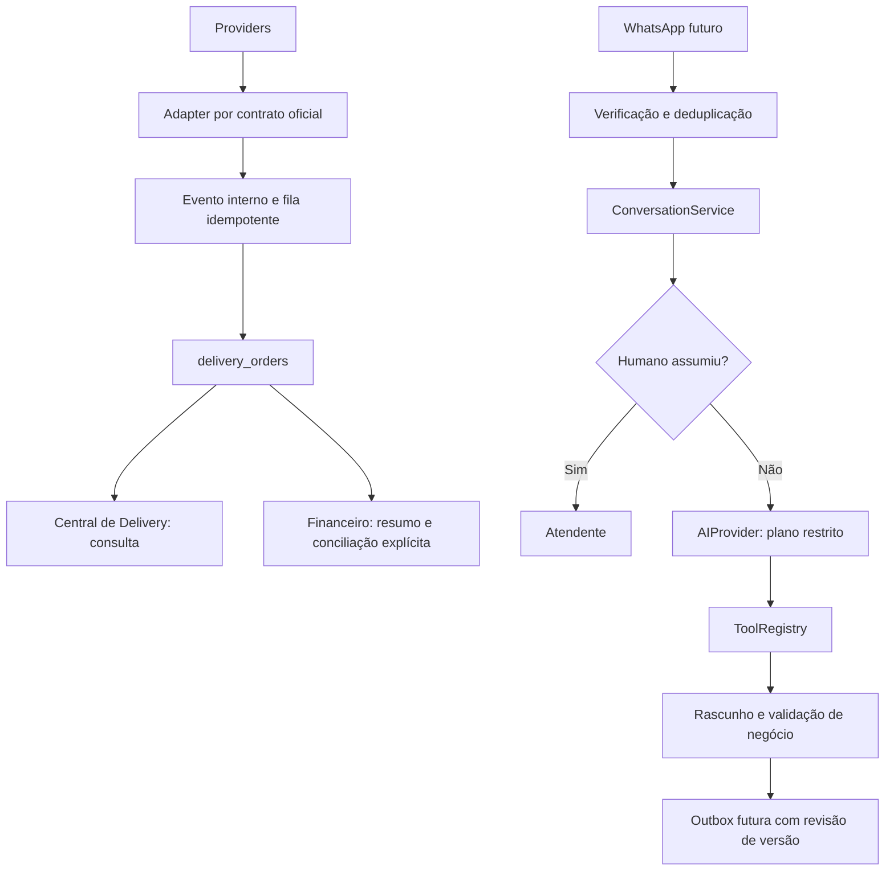

# Central de Delivery — base arquitetural

## Auditoria e decisões

Início: agente-2 limpa em 43b7227; origin/main em 8509a83. Nenhum merge realizado.
O sistema já possui quatro tabelas delivery protegidas, adaptador iFood distribuído,
fila/ACK, criptografia e consulta financeira. Não há entidades próprias de clientes,
conversas ou cardápio. CashMovement é fechamento/conferência diária, não pedido.
DeliverySettlement e ManualReconciliation são entidades financeiras existentes;
não devem receber importações automáticas. ProductionProduct/InventoryItem não
serão modificados nem tratados automaticamente como catálogo público.

Decisões desta rodada:

- Reutilizar delivery_orders e o backend existente, sem nova tabela de pedidos.
- Central em `/delivery`, independente de Financeiro.jsx, com acesso autenticado
  e verificação adicional das integrações; API mantém autorização server-side.
- Separar provider, pedido, evento, cliente, catálogo, conversa e financeiro.
- Sem novas migrations, envio de mensagens, modelo IA, publicação ou credenciais.
- Canal próprio não é sinônimo dos totais manuais de delivery próprio no caixa.
  Pedidos desse canal serão implementados posteriormente, sem converter movimentos.

## Arquitetura

O diagrama inclui partes futuras. Somente iFood tem API preparada. O registro
delivery-providers delega ao adaptador existente; a persistência transacional
atual continua responsável por aplicar eventos. normalizeEvent fornece contrato
interno para evolução sem reescrever o pipeline validado.

## DeliveryOrder

Projeção pública em src/lib/delivery/domain.js, sem alterar registros antigos:

| Campo | Origem/decisão |
|---|---|
| provider, merchantId, externalId | platform, merchant_id, external_id; identidade composta validada |
| displayId | number, sem inventar número |
| status | estado normalizado atual; preparing reservado, não inferido de confirmed |
| items | itens normalizados e quantidades; ausência permanece null |
| money | centavos: subtotal, descontos, entrega, total do cliente; líquido desconhecido |
| payment | métodos informados, sem afirmar liquidação |
| customer, address | null nesta etapa, sem exposição de dados pessoais |
| deliveryType | null até adaptador incorporar campo oficial validado |
| timestamps | horário do pedido e último evento |
| rawReference | ID do evento, nunca corpo bruto ou token |

Identidade por provider/merchant/pedido evita colisões. Evento interno contém
provider, merchantId, externalOrderId, eventId, occurredAt, type e envelope mínimo.
Providers bloqueados não aceitam normalização presumida. Payloads de terceiros
nunca viram comandos administrativos. Futuras alterações de estado exigem
permissão, transição válida e confirmação da plataforma; tela atual só consulta.

## Central e dashboard

Rota autenticada /delivery e item de menu em Operação. Filtros por dia, canal,
estado; busca por número/ID, extensível a cliente/telefone autorizado. Hoje não
há PII importada, portanto busca por cliente não inventa resultados.
Cards exibem itens, total, pagamento, horários e campos indisponíveis explicitamente.
Paginação até 10 mil pedidos; excesso falha sem apresentar totais parciais.
Indicadores são por data/canal, antes de busca/status: pedidos, vendas concluídas,
ticket de concluídos, preparando, aguardando aceite, cancelados. Cancelados não
entram nas vendas. Sem sincronização não há números fictícios. Consulta vazia
não prova ausência de vendas. Indicadores não são receitas/caixa ou repasses.
KDS nesta etapa é apenas direção arquitetural, sem impressora, fila de preparo
operante, som, aceite/cancelamento ou atualização automática de pedidos.

## Providers

- iFood: adaptador existente, authorization_code/refresh_token, merchants, polling
  e ACK após persistência. Webhook continua bloqueado para autenticação distribuída.
  Nenhum endpoint alterado; fontes e homologação em delivery-integrations.md.
- 99Food: registro de capacidades e adapter bloqueado. Sem contrato oficial
  verificável, nenhum endpoint, OAuth, assinatura, status ou payload presumido.
- WhatsApp: registro bloqueado, sem SDK, webhook ou saída de mensagens.
- Canal próprio: registro bloqueado; futuro serviço de rascunho/checkout com
  validação de preço, disponibilidade, pagamento e confirmação explícita.

Solicitar à 99Food pelo portal/parceria oficial: elegibilidade e cadastro do
integrador, contrato OpenAPI versionado, sandbox/loja teste, processo de autorização
do lojista, permissões, identificação App/Shop **conforme o contrato recebido**,
nomes/formato das credenciais, expiração/renovação/revogação, pedidos/eventos,
assinatura/ACK/replay, paginação, limites, catálogo, cancelamento e homologação.
Não afirmamos que App ID/Shop ID ou OAuth específicos sejam obrigatórios sem prova.
Também solicitar política de uso/retencão de dados, operação conjunta com PDV,
financeiro e suporte técnico. Credenciais nunca em chat/Git/frontend.

## DeliveryCustomer

Contrato server-side em delivery-catalog.mjs: id interno, merchantId, identities
por provider/externalCustomerId, profile restrito e history com orders,
lastOrderAt, averageTicket, channels. Valores históricos permanecem null até
serem derivados de pedidos vinculados e autorizados. Nenhuma tabela implantada.
Não associar pessoas por nome/telefone automaticamente; não reutilizar Employee/RH.
Identidade multicanal futura exige validação explícita e escopo da empresa/loja.

## Cardápio e mapeamento

catalogMapping valida provider, merchantId, internalProductId, externalProductId,
revision. Chave externa composta; mesmo ID de outra loja não colide. Catálogo
publicável terá descrição, variações/sabores, complementos, preço e disponibilidade
próprios; vínculo ao produto interno não dá permissão de editar estoque.
Definir entidade interna publicável após auditoria comercial; não exportar todos
os InventoryItems nem ProductionProducts indiscriminadamente. Futuro publish de
catálogo: revisão humana, versão, preço validado, idempotência e retorno por canal.
Não há sincronização de cardápio ou preço nesta rodada.

## WhatsApp e IA: interfaces server-side, não bot operante

delivery-assistant.mjs contém AIProvider (não configurado), ConversationService e
ToolRegistry. Não importa SDK/modelo, não contém chave e não está em Edge pública.
AIProvider.plan recebe mensagem não confiável e lista de capacidades, retorna
plano restrito. ConversationService só grava rascunho; não envia resposta.
O store em memória continua existindo apenas nos testes; a persistência desta rodada
está descrita em "Atendimento persistido". Não existe ferramenta de negócio com escrita
(checkout, pedido final, Financeiro ou estoque).

Ferramentas permitidas: consultarCardapio, consultarHorario, consultarProduto,
criarRascunhoPedido, adicionarItem, removerItem, consultarPedido, transferirParaHumano.
Registro não aceita nomes externos. Argumentos são exatos; sem preço/desconto,
quantidades inválidas ou SQL. Escopo verificado não pode vir do modelo/browser.
Handlers futuros devem validar proprietário de pedido/rascunho, produto publicável,
preço atual, complementos e permissões. Não criar pedido final sem confirmação.
Não há ferramentas para Financeiro, estoque, RH, exclusão de pedidos ou administração.
Modelo não deve afirmar estoque/preço/status sem resultado validado; a resposta
atual é rascunho, sem garantia de factualidade nem envio automático.

Contrato do store.withConversation: autenticar escopo servidor, autorizar
subjectId/provider/merchantId, bloquear linha, executar callback em transação,
rollback em erro e gravar versão/IDs processados. Handlers com escrita precisam
participar da mesma transação; efeitos externos somente outbox transacional.
Não usar o store de teste em produção. Adicionar quotas por remetente/loja,
limites de custo/modelo, auditoria sem corpo sensível, expiração e retenção de IDs.

Human handoff: estados ai/human e version monotônica. Só operador autorizado
pode reassumir/devolver; IA pode solicitar transferência. Assumir limpa resposta
pendente e invalida plano em voo. Antes de futura entrega, outbox deve conferir
modo e versão sob lock e cancelar itens anteriores. O adaptador de envio deve
implementar lease/idempotência e definir corrida de envio já iniciado; não há
garantia de cancelamento de mensagem entregue. Hoje nenhuma mensagem é enviada.

## Atendimento persistido (migration preparada, não aplicada)

Fecha a infraestrutura de atendimento: clientes, conversas, mensagens e handoff humano.
A migration 202609290001_delivery_conversations.sql está versionada apenas para revisão:
nada foi aplicado no Supabase, nenhuma policy foi criada e não houve deploy. Os testes
executam a migration real em PostgreSQL na memória (PGlite).

Identidade: delivery_customers é única por (provider, merchant_id, external_id). Nome e
telefone nunca identificam nem associam pessoas; são dados informados pelo provedor,
preenchidos apenas quando ausentes e nunca sobrescritos. delivery_conversations é única
por (provider, merchant_id, external_id), referencia o cliente no mesmo escopo e nasce em
modo humano. delivery_messages pertence à conversa e deduplica por (conversation_id,
direction, external_id): o mesmo ID externo em outra loja ou provedor não colide.

Conversa: modo explícito ai|human, responsável atual e version monotônica. Mensagem
aceita ou rascunho persistido incrementam a versão. occurred_at é o horário do provedor e
received_at o do recebimento; mensagem atrasada entra na história pelo horário do
provedor, não sobrescreve modo/responsável e invalida rascunho pendente (falha segura).

Handoff: delivery_set_handoff exige operador com can_manage no escopo da loja, audita uma
linha por transição de versão (sem corpo de mensagem) e é idempotente na repetição.
Assumir invalida rascunhos ainda não entregues e mantém o modo humano até um operador
autorizado devolver o atendimento à IA.

Resposta atrasada da IA: delivery_save_ai_draft grava o rascunho somente após revalidar
modo e versão sob lock. Se o humano assumiu durante a inferência, a versão mudou, o
rascunho é descartado e nenhuma mensagem outbound é criada. Não existe operação de envio:
o rascunho fica registrado como draft e nunca é entregue.

Ferramentas: ToolRegistry permanece allowlist server-side; o serviço persistente executa
apenas ferramenta registrada com escopo verificado. transferirParaHumano é somente
solicitação (quem altera o modo é o operador autorizado) e SQL, RH, Financeiro, estoque,
usuários ou administração não são ferramentas disponíveis.

Autorização: leitura de clientes/conversas/mensagens passa por sessão verificada e escopo
da loja no servidor; assumir/devolver exige perfil administrativo e can_manage. Nenhuma
tabela de atendimento concede policy ou grant a anon/authenticated.

## Central de atendimento (interface desta fase)

A rota `/delivery` virou uma central com três abas: **Conversas**, **Clientes** e
**Pedidos** (a consulta de pedidos foi preservada sem redesenho). A verificação de
acesso e o status dos canais continuam no topo, com `deliveryStatus` e o
`food99Blocker` vindo do servidor — nada de status fixado no frontend.

- Conversas: filtros por canal, loja, modo (humano/IA), responsável, somente não
  lidas e busca por nome/telefone/ID/conteúdo recente da conversa. Lista ordenada
  por última mensagem; painel em ordem cronológica; gaveta de perfil; ações
  "Assumir" e "Devolver para IA" habilitadas apenas com o `can_manage` do servidor
  (a autorização real continua server-side; o navegador só reflete).
- Responsável exibido como "Você", "Outro operador" ou "Sem responsável" usando o
  `actorId` de `contact_scopes`; nomes de operadores não são inventados.
- Estado "aberta/finalizada" não existe no modelo (`mode`, `version`,
  `assigned_to`), então o filtro de fechamento **não** foi criado nem simulado.
- Atualização manual e automática a cada 60s preserva linhas, seleção e filtros;
  uma falha mostra o erro sem apagar o que já estava na tela.
- Resposta: a caixa grava apenas rascunho local (localStorage por conversa) e o
  envio permanece desabilitado ("Envio ainda não habilitado"). Não existe
  operação de envio no cliente nem no backend.
- Auditoria na tela: transições de handoff lidas de `delivery_handoff_audit`,
  com nota de que eventos de mensagem/rascunho ainda não têm histórico.

## Mensagens não lidas (migration preparada, não aplicada)

Auditoria do modelo anterior: `mode`, `version` e `assigned_to` não registram
**quem leu** nem **quando** — era impossível derivar "não lidas" entre múltiplos
atendentes sem inventar estado, e um contador só no navegador falharia para dois
operadores ao mesmo tempo. A migration `202609300001_delivery_attendance_ops.sql`
cria `delivery_conversation_reads`, marcador por (usuário, conversa) com chave
composta provider/loja. NÃO aplicada.

Derivação no servidor em `contactAction('conversations')`: contagem de mensagens
inbound não invalidadas recebidas após o marcador do operador. Conversa **sem**
marcador usa a janela das 1000 mensagens mais recentes da página (limite
documentado: a contagem pode subestimar conversas antigas até a primeira
leitura; depois o marcador a torna exata). A ação `mark_read` persiste o
marcador quando a conversa é aberta; o zero de "lida" também é persistido.

## Auditoria de eventos: o que existe e o que falta

| Evento | Existe hoje? | Onde |
|---|---|---|
| IA habilitada, humano assumiu, humano devolveu, troca de responsável | Sim | `delivery_handoff_audit` (ator, modo, versão, data) |
| Mensagem recebida | Não como evento | Apenas o registro em `delivery_messages` |
| Rascunho criado (IA) | Não como evento | Apenas `status='draft'` em `delivery_messages` |
| Rascunho invalidado | Não como evento | Apenas `status='invalidated'` |

A migration preparada cria `delivery_attendance_events` para os três tipos que
faltam (com ID externo da mensagem, nunca o corpo). Nada é inserido nesta fase e
nenhum histórico retroativo é fabricado: quando a migration for aplicada e a
ingestão/rascunho passarem a gravar, a auditoria mostrará esses eventos.

## Outbox de mensagens (desenho para revisão, sem envio)

A mesma migration versiona `delivery_outbox`, ainda sem nenhum código que a use:

- Identidade: provider + loja + `idempotency_key` única (replay não duplica).
- Estado: `pending → leased → sent | failed | cancelled`, com `attempts`,
  `max_attempts`, `next_attempt_at`, `last_error` e CHECK exigindo `sent_at` +
  `external_message_id` quando `sent`.
- Lease: `lease_owner`/`lease_until` para worker exclusivo com expiração (retry
  seguro sem dupla entrega concorrente).
- Contexto: grava `conversation_version` e `conversation_mode` no enfileiramento;
  o worker futuro revalida modo e versão sob lock antes de enviar e cancela itens
  anteriores da mesma conversa (corrida já prevista no ConversationService).
- `approved_by` identifica o operador que aprovou; rascunho de IA sozinho nunca
  vira envio.

## iFood: o que existe e o que falta

Existe (detalhes em delivery-integrations.md): adaptador distribuído com
authorization_code/refresh_token cifrados, lista de merchants, ingestão por
polling com ACK após persistência, fila idempotente e consulta de pedidos.
Webhook continua bloqueado para autenticação distribuída.

Falta antes de homologação: credenciais/consentimento do estabelecimento,
pacote de configuração do proprietário, polling habilitado em ambiente
aprovado, sandbox/homologação oficial, validação de eventos fora de ordem e
retenção de PII conforme o contrato recebido. Nada disso é simulado na tela.

## WhatsApp: pontos de integração previstos

1. `PROVIDER_CAPABILITIES.whatsapp` já existe com `commands:false` e adapter
   bloqueado (`PROVIDER_CONFIGURATION_REQUIRED`): nenhum SDK, URL, credencial ou
   webhook é presumido.
2. Entrada prevista: webhook/ingestão do contrato oficial escolhido →
   verificação/deduplicação → RPC `delivery_receive_message` (já versionada),
   que cria cliente/conversa/mensagem sem alterar modo ou pedido.
3. Modo e concorrência: ConversationService/handoff auditado já resolvem
   humano × IA por versão monotônica.
4. Saída: somente a `delivery_outbox` aprovada poderá enviar, com lease e
   idempotência; hoje não existe código de envio em nenhuma camada.
5. Tela: o canal aparece como "sem envio nesta fase"; nenhum controle de envio
   é exibido como se funcionasse.

## Contrato do fluxo de pedido na interface futura

`consulta da conversa → consultarCardapio (grounding obrigatório) →
criarRascunhoPedido → adicionarItem/removerItem (revalidação de preço e
disponibilidade a cada passo) → resumo com total → confirmação explícita do
operador/cliente → criação idempotente do pedido no canal → consultarPedido
para status`. Regras: sem preço ou disponibilidade inventados, sem item fora do
catálogo publicável, sem confirmação implícita e qualquer saída externa (pedido
ou mensagem) só transita pela outbox aprovada. Esta fase não implementa o fluxo;
aqui a conversa termina em rascunho local.

## Segurança e privacidade

Tokens iFood cifrados e server-side, controles de acesso/RLS existentes intactos.
Persistência de clientes/conversas está versionada, mas não aplicada: nome/telefone só
existem quando o provedor informa e só são retornados a operador autorizado da loja,
nunca ao frontend anônimo, à IA ou a outra loja.
Planejar autorização por loja, acesso mínimo, trilha auditável por metadados,
verificação de webhooks por contrato, prevenção de replay, deduplicação e limites.
Antes de coletar dados pessoais, definir finalidade/base legal, aviso, retenção,
atendimento ao titular, permissões, exclusão/exportação e contratos dos operadores.
Nenhum marketing ou compartilhamento de PII com IA habilitado. Não declaramos
conformidade LGPD completa; revisão organizacional e jurídica continua necessária.
Referência: [orientação ANPD](https://www.gov.br/anpd/pt-br/assuntos/noticias/anpd-publica-guia-de-seguranca-para-agentes-de-tratamento-de-pequeno-porte).

## Próximas etapas e ações do proprietário

1. Validar Central em desenvolvimento, terminologia operacional e quais produtos
   compõem o cardápio público. Decidir perfis de atendimento/cozinha.
2. Cumprir configuração e homologação iFood do guia delivery-integrations.md.
3. Solicitar pacote oficial 99Food descrito acima; não fornecer segredos ao Git.
4. Escolher canal oficial WhatsApp, obter contratos, sandbox, documentação de
   autorização/webhook/envio e requisitos comerciais antes de implementar.
5. Escolher provedor IA, política de dados/custos e revisão de ferramentas; chave
   somente no servidor. Implementar grounding, validação e avaliação antes de envio.
6. Revisar e autorizar as migrations de atendimento (202609290001: clientes,
   conversas, mensagens, rascunhos e auditoria de handoff; 202609300001: marcador
   de não lidas, eventos de atendimento e outbox) e definir quem popula
   delivery_operator_scopes em homologação. Nada foi aplicado; catálogo segue
   apenas projetado.
7. Após a revisão: aplicar em ambiente aprovado, ligar a ingestão de mensagens à fila
   verificada, construir a outbox transacional com lease/idempotência e expor a tela de
   atendimento. Validar todas as escritas em sandbox antes de produção.
8. Implementar canal próprio/checkout, pagamentos, KDS e conciliação separadamente.
9. Somente após testes e autorização específica: merge, deploy e publicação.

## Testes e limites

test:delivery inclui contratos, filtros, métricas, PII ausente, isolamento, adapters
bloqueados, ferramentas proibidas, handoff em voo e replay, além dos testes iFood.
delivery-contacts.test.mjs cobre clientes, conversas, mensagens, deduplicação, eventos
fora de ordem, isolamento por loja, handoff idempotente, descarte de resposta atrasada da
IA, autorização de operador e RLS/grants com a migration real em PGlite.
delivery-attendance.test.mjs cobre a central de atendimento: enriquecimento e
não lidas no servidor, filtros/ordenação/seleção da interface, handoff e avisos,
auditoria, marcador de leitura, rascunho local sem rede, ausência de operação de
envio e a migration 202609300001 em PGlite (constraints, RLS e grants), sempre com
fetch bloqueado.
Sem credenciais reais, sem SQL remoto ou mensagens. Regressões locais existentes
continuam necessárias. Nenhuma mudança em Financeiro.jsx, Auth, estoque ou produção.
